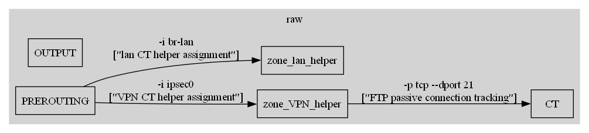

# iptables-viewer

一个将 `iptables-save` 文件可视化为链路关系图（PNG）的工具。

## 安装与环境

- Python 3.10+
- Python 包：`graphviz`（已在 `requirements.txt` 中）
- 系统需安装 Graphviz 可执行程序（dot 等）。
	- Windows: 安装后需将 Graphviz 安装目录下的 `bin` 加入 PATH（例如：`C:\\Program Files\\Graphviz\\bin` 或你下载解压目录的 `...\\Graphviz-13.x.x-win64\\bin`）。

安装依赖：

```powershell
# 在项目目录下
pip install -r requirements.txt
```

若你使用本仓库自带的 venv，可用：

```powershell
# 示例：在 PowerShell 中临时追加 Graphviz 到 PATH 并运行
$env:Path += ";C:\\Path\\To\\Graphviz\\bin"
# 通过 stdin 传入配置文件路径，避免交互输入
"iptables-save.txt" | .\\.venv\\Scripts\\python.exe .\\main.py
```

## 用法

程序启动后会提示输入 `iptables-save` 文件路径（默认当前目录的 `iptables-save.txt`）。

命令行可选参数：

- `-k, --keyword <str>`：关键字过滤。仅展示与关键字“同一条有向链路”的节点与边（命中节点 ∪ 所有祖先 ∪ 所有子孙）。
- `-S, --show-build-in [list]`：控制内置目标/节点显示（ACCEPT, DROP, REJECT, LOG, RETURN, MASQUERADE, AUDIT, CT）。
	- 不提供 `-S`：隐藏所有内置目标/节点（默认）。
	- 仅写 `-S`（无参数）：显示全部内置目标/节点。
	- `-S accept,reject`：仅显示给定的内置目标/节点（大小写不敏感，逗号分隔）。

标签显示规则（边上的三行，按需展示）：

1) 条件（链名与 `-j` 之间的参数，去除注释模块及注释内容）
2) 注释（提取 `--comment "..."`，以 `["..."]` 形式；若无则不显示该行）
3) 目标动作参数（`-j <TARGET>` 之后的参数，前缀 `--> `；若无则不显示该行）

输出：

- 在项目目录生成 `iptables_graph.png`。

## 示例

仅关键字过滤（隐藏所有内置）：

```powershell
$env:Path += ";C:\\Path\\To\\Graphviz\\bin" ; cd "c:\\Users\\donnie\\Desktop\\iptables-viewer"
"iptables-save copy.txt" | .\\.venv\\Scripts\\python.exe .\\main.py -k clash
```

显示全部内置：

```powershell
$env:Path += ";C:\\Path\\To\\Graphviz\\bin" ; cd "c:\\Users\\donnie\\Desktop\\iptables-viewer"
"iptables-save copy.txt" | .\\.venv\\Scripts\\python.exe .\\main.py -S
```

仅显示指定内置（ACCEPT、REJECT）：

```powershell
$env:Path += ";C:\\Path\\To\\Graphviz\\bin" ; cd "c:\\Users\\donnie\\Desktop\\iptables-viewer"
"iptables-save copy.txt" | .\\.venv\\Scripts\\python.exe .\\main.py -k clash -S accept,reject
```

## 常见问题

- 报错 `ExecutableNotFound: failed to execute 'dot'`：
	- 未安装系统 Graphviz 或 `bin` 未加入 PATH。为当前终端临时追加 PATH 后再运行，或重启 VS Code 让环境继承系统 PATH。

## 效果图

